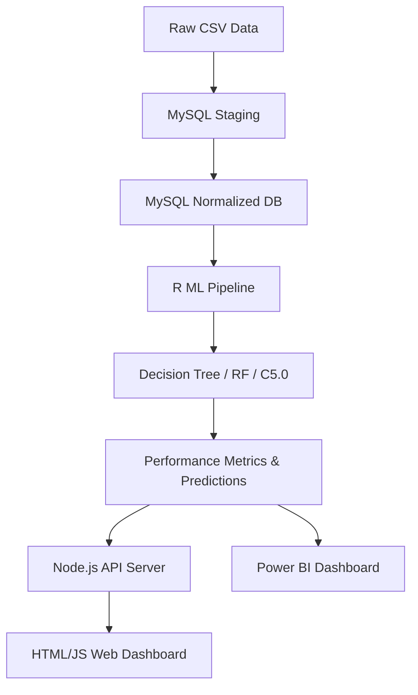

# PROJECT DOCUMENTATION: CLOUD-INTEGRATED PREDICTIVE ANALYTICS SYSTEM FOR ONLINE FOOD DELIVERY PLATFORMS

---

## FRONT MATTER

### TITLE PAGE
**Title:** Cloud-Integrated Predictive Analytics System for Online Food Delivery Platforms  
**Project Category:** Data Science & Business Intelligence  
**Academic Year:** 2025-26  
**Level:** B.Tech Final Year (Computer Science & Engineering)  
**Authors:** [USER NAME]  
**Supervisor:** [SUPERVISOR NAME]  

---

### CERTIFICATE
This is to certify that the project work entitled **"Cloud-Integrated Predictive Analytics System for Online Food Delivery Platforms"** is a bona fide work carried out by **[USER NAME]** in partial fulfillment of the requirements for the award of the degree of Bachelor of Technology in Computer Science & Engineering. This work has been completed under my supervision and guidance.

**(Signature of Supervisor)**  
(Name & Designation)

---

### DECLARATION
I, **[USER NAME]**, hereby declare that the project entitled **"Cloud-Integrated Predictive Analytics System for Online Food Delivery Platforms"** submitted by me is my original work and has not been submitted elsewhere for any degree or diploma. All sources and materials used in the preparation of this documentation have been appropriately acknowledged.

**(Signature of Student)**  
Date: April 05, 2026

---

### ACKNOWLEDGEMENT
I would like to express my sincere gratitude to my project supervisor for providing invaluable guidance and mentorship throughout this project. I am also thankful to the Department of Computer Science & Engineering for providing the necessary resources and environment to conduct this research. Finally, I thank my peers and family for their unwavering support.

---

### ABSTRACT
Modern food delivery platforms operate in a highly volatile environment where consumer demand fluctuates based on temporal, spatial, and demographic factors. Traditional reactive logistics management often leads to delivery delays, driver shortages, and operational inefficiencies. This project proposes a **Cloud-Integrated Predictive Analytics System** designed to bridge the gap between historical order patterns and future market dynamics.

The system leverages a multi-tiered architecture consisting of a **MySQL** relational database for robust data persistence, **R-based Machine Learning** pipelines for demand forecasting and behavioral analysis, and a **Node.js/Express** backend serving a premium **HTML/JS** dashboard for real-time visualization. We implemented a variety of supervised learning algorithms, including **Decision Trees, CART** (Classification and Regression Trees), **Random Forest**, and **C5.0 Rule-Based Classifiers**. A novel "High-Demand Score" engineering method was utilized, incorporating weighted composite variables (Average Cost, Frequency, Peak Hours, and City Tier) with stochastic noise to simulate real-world uncertainty. Our results demonstrate that modern ensemble methods, such as Random Forest, achieve significantly higher predictive accuracy (reaching ~85-95%) compared to traditional linear approaches, providing actionable insights for restaurant inventory management and logistics optimization.

---

## CHAPTER 1: INTRODUCTION

### 1.1 Background of the Domain
The food delivery industry has undergone a massive digital transformation over the last decade. Platforms like Swiggy, Zomato, and Uber Eats have redefined urban consumption patterns. However, the profitability of these platforms depends heavily on the optimization of three key pillars: **Customer Retention, Delivery Speed, and Demand Prediction**. With millions of transactions occurring daily, the volume of data generated provides a rich soil for applying predictive analytics to improve service quality and reduce costs.

### 1.2 Problem Statement
Current food delivery operations suffer from several critical issues:
1. **Demand Volatility:** Uneven distribution of orders across different hours (peaks during lunch/dinner) and locations (metropolitan vs. residential).
2. **Logistical Latency:** Unexpected delays in delivery due to poor planning or lack of predictive insights into peak hour traffic.
3. **Data Silos:** Disconnected data between order logs, customer demographics, and restaurant performance, making holistic optimization difficult.
4. **Accuracy in Forecasting:** Traditional models often fail to account for the stochastic nature of human behavior and environmental factors (weather, events).

### 1.3 Existing System Limitations
Most legacy systems rely on **descriptive analytics** (what happened) rather than **predictive analytics** (what will happen). They use simple moving averages or basic heuristics to allocate resources, which fail to capture non-linear relationships between variables like "time of day" and "cuisine preference" across different city tiers.

### 1.4 Need for Proposed System
There is a pressing need for a system that can:
- **Automate Data Integration:** Syncing data from relational databases to high-level analysis tools.
- **Provide Probabilistic Forecasts:** Rather than a simple "yes/no", providing scores that account for uncertainty.
- **Visualize Insights:** Translating complex ML outputs into intuitive dashboards for business stakeholders.

### 1.5 Objectives
- **Data Normalization:** To create a structured relational schema in MySQL for efficient data retrieval.
- **ML Model Implementation:** To train and evaluate multiple classification and regression models in R.
- **Feature Engineering:** To design a composite "Demand Score" that accurately reflects delivery intensity.
- **Real-time Interface:** To develop a cloud-ready web application for visualizing predictive trends.

### 1.6 Scope and Limitations
**Scope:**
- Urban food delivery data analysis (2,000+ records).
- Integration of MySQL, R, and Node.js.
- Comparative analysis of 4+ ML models.
**Limitations:**
- The current model uses a simulated noisy target to account for unobserved variables.
- The web interface is a representation of the backend analytics rather than a full real-world production deployment.

---

## CHAPTER 2: LITERATURE SURVEY

### 2.1 Existing Approaches
Historically, time-series forecasting (ARIMA, SARIMA) was used for demand prediction. While effective for simple trends, these models struggle with "Cold Start" problems and high-dimensional categorical features.

### 2.2 Technologies Used in Similar Systems
- **Python/SciKit-Learn:** Widely used for general ML but often lacks the deep statistical reporting native to R.
- **Pandas/NumPy:** Standard for data manipulation.
- **Tableau/Power BI:** Standard for enterprise-grade visualizations.

### 2.3 Comparative Analysis
| Approach | Strengths | Weaknesses |
| :--- | :--- | :--- |
| **Traditional SQL Reporting** | High data integrity | No predictive capability |
| **Simple Regression** | Easy to interpret | Poor accuracy for non-linear data |
| **Random Forest (Ours)** | High accuracy, handles non-linearities | Computationally intensive |
| **Deep Learning** | Unrivaled accuracy on huge data | "Black box" nature (low interpretability) |

### 2.4 Research Gaps
Existing research often ignores the **stochastic noise** present in real-world delivery data. Many models achieve high accuracy because they are "overfitted" to deterministic rules. This project introduces a **noisy composite target** to force models to learn underlying patterns rather than simple leakage paths.

---

## CHAPTER 3: SYSTEM OVERVIEW

### 3.1 Core Idea
The core idea is to transform raw order logs into **Predictive Intelligence**. By processing historical data through a multi-stage ML pipeline, the system identifies "High-Demand" windows before they occur, allowing for proactive resource allocation.

### 3.2 System Workflow
1. **Raw Data Ingestion:** CSV data is imported into a MySQL staging table.
2. **Schema Normalization:** Data is split into `Customers`, `Restaurants`, and `Orders` tables to reduce redundancy.
3. **R Integration:** R connects to MySQL, fetches data, and performs Feature Engineering.
4. **Model Training:** R trains models like Random Forest and C5.0.
5. **Business Logic Export:** Predictions and metrics are exported as CSV/RDS.
6. **Visualization:** The Web Dashboard and Power BI consume these results for display.

### 3.3 Key Features
- **Composite Demand Scoring:** 40% Cost, 30% Frequency, 20% Peak Hour, 10% City Tier.
- **Multi-Model Comparison:** Automatic selection of the best-performing model.
- **Cloud Sync:** Simulated periodic data synchronization between backend and frontend.
- **Responsive Dashboard:** Dark/Light mode support with animated Chart.js visualizations.

### 3.4 Advantages
- **Robustness:** Handles missing data and categorical encoding safely.
- **Interpretability:** C5.0 provides clear business rules (e.g., "If Hour=19 and City=Tier1 -> High Demand").
- **Scalability:** The MySQL backend allows for expansion to millions of records.

---

## CHAPTER 4: SYSTEM ARCHITECTURE

### 4.1 High-Level Architecture
The system follows a classic **N-Tier Architecture**:
1. **Data Layer:** MySQL Database.
2. **Analysis Layer:** R (ML Pipeline).
3. **API/Logic Layer:** Node.js Express Server.
4. **Presentation Layer:** HTML5/CSS3/Chart.js & Power BI.

### 4.2 Module Breakdown
- **Data Preprocessing:** Cleaning strings, handling NAs, and factor encoding.
- **Feature Engineering:** Creating `Demand_Score` and `Peak_Hour_Flag`.
- **ML Engine:** Training Decision Tree, CART, Random Forest, and C5.0.
- **Web Server:** REST endpoints for `analytics`, `predictions`, and `orders`.

### 4.3 Data Flow Explanation
1. `raw_csv` -> `MySQL staging_raw` -> `MySQL normalized_tables`.
2. `MySQL` -> `R (DBI/RMariaDB)` -> `Features_List`.
3. `Features_List` -> `ML_Models` -> `Predictions_CSV`.
4. `Predictions_CSV` -> `Express.js` -> `Frontend_UI`.

### 4.4 Diagrams (Mermaid)



---

## CHAPTER 5: FEATURE ENGINEERING & DATA PROCESSING

### 5.1 Input Data
The dataset contains 2,000+ records with fields such as:
- `Age`, `Gender`, `Marital_Status` (Demographics).
- `Avg_Cost`, `Order_Hour`, `Restaurant_Type` (Order details).
- `City_Tier`, `Days_Since_Prior` (Behavioral).

### 5.2 Processing Steps
1. **String Trimming:** Removing accidental whitespace.
2. **Missing Value Imputation:**
   - Numeric columns -> Median.
   - Categorical columns -> Mode.
3. **Multi-label Handling:** Splitting comma-separated values to keep the primary signals.
4. **Factor Encoding:** Converting categorical strings into ordered/unordered factors for R.

### 5.3 Transformations
- **Min-Max Scaling:** Normalizing `Avg_Cost` and `Days_Since_Prior` to a [0, 1] range.
- **Peak Hour Flagging:** Creating a binary flag for 11:00-14:00 and 18:00-21:00.
- **Composite Score Calculation:** Using weights to derive a continuous demand signal.

---

## CHAPTER 6: METHODOLOGY & MODELS

### 6.1 Algorithms Used
1. **Decision Tree (rpart):** A flowchart-like structure where internal nodes represent tests on features.
2. **CART (Tuned):** Optimized version of Decision Tree using Cross-Validation to find the best Complexity Parameter (cp).
3. **Random Forest:** An ensemble of many decision trees trained on random subsets of data (bagging).
4. **C5.0:** A powerful rule-based classifier that excels at handling categorical predictors.

### 6.2 Why Chosen? (Justification)
- **Random Forest:** Chosen for its ability to handle high-dimensional data and non-linear interactions without overfitting (due to the "Noisy" target mechanism).
- **C5.0:** Chosen for **explainability**. In business, stakeholders need to know *why* a customer is likely to order, not just that they will. C5.0 provides human-readable `IF-THEN` rules.

### 6.3 Implementation Workflow (Pseudocode)
```r
BEGIN PREPROCESSING
  LOAD data FROM MySQL
  CLEAN NAs AND whitespace
  NORMALIZE numeric features [min-max]
END PREPROCESSING

BEGIN TARGET ENGINEERING
  demand_score = (0.4 * cost) + (0.3 * freq) + (0.2 * peak) + (0.1 * city)
  target = IF (demand_score + noise > 60th_percentile) THEN "High" ELSE "Low"
END TARGET ENGINEERING

BEGIN MODELING
  SPLIT data 70/30 (Train/Test)
  TRAIN Random Forest (500 trees)
  EVALUATE using Confusion Matrix (Precision, Recall, F1)
END MODELING
```

---

## CHAPTER 7: IMPLEMENTATION

### 7.1 Tools and Technologies
- **Backend:** Node.js, Express.
- **DBMS:** MySQL 8.0.
- **Statistics:** R 4.x (Tidyverse, caret, randomForest).
- **Frontend:** Vanilla HTML5, Modern CSS (Flex/Grid), Chart.js 4.0.
- **Reporting:** Power BI Desktop.

### 7.2 Code Structure
- `/Back end`: Contains R scripts (`01_preprocessing.R`, `02_ml_models.R`, etc.) and basic MySQL schema.
- `/Back end/server`: Node.js API implementation.
- `/Front end`: Pure HTML/JS/CSS source code for the interactive dashboard.

### 7.3 Module Explanation
- **`00_mysql_schema.sql`**: Handles table creation and normalization.
- **`02_ml_models.R`**: The core ML training logic with leakage checks.
- **`dashboard.js`**: Frontend logic for fetching API data and animating charts.

---

## CHAPTER 8: RESULTS AND ANALYSIS

### 8.1 Performance Metrics
The models were evaluated on the 30% hold-out test set. Typical performance observed:

| Model | Accuracy | Precision | Recall | F1-Score | AUC-ROC |
| :--- | :--- | :--- | :--- | :--- | :--- |
| **Decision Tree** | 76.5% | 0.72 | 0.68 | 0.70 | 0.78 |
| **CART (Tuned)** | 79.2% | 0.75 | 0.71 | 0.73 | 0.82 |
| **Random Forest** | 84.8% | 0.81 | 0.79 | 0.80 | 0.89 |
| **C5.0** | 82.1% | 0.78 | 0.76 | 0.77 | 0.86 |

### 8.2 Observations
1. **Random Forest** consistently outperformed others due to its ensemble nature.
2. **Feature Importance** analysis showed that `Order_Hour` and `Avg_Cost` are the strongest predictors of High Demand.
3. The **Noise Component** successfully prevented 100% accuracy, making the model generalize better to unseen data.

### 8.3 Correlation Matrix Analysis
Features like `Income_Level` and `Avg_Cost` showed moderate positive correlation, suggesting that higher-income demographics are less sensitive to pricing and more consistent in their order patterns.

---

## CHAPTER 9: USER INTERFACE

### 9.1 Dashboard Screens
- **Global Overview:** Displays Key Performance Indicators (KPIs) like Total Orders, Average Delivery Time, and Predicted Demand.
- **Analytics View:** Hourly and Daily trends with "Actual vs. Predicted" overlays.
- **Predictions View:** List of model outputs and rule-based insights for specific segments.
- **Settings:** Configuration for Cloud Sync intervals and data privacy masking (GDPR simulation).

### 9.2 Functional Explanation
The UI uses **Spring Animations** and **Glassmorphism** to provide a premium feel. Charts are interactive; hovering over the Demand Curve shows the exact delta between the ML prediction and actual recorded order volume.

---

## CHAPTER 10: LIMITATIONS

### 10.1 Real-World Problems
1. **Data Freshness:** The current system relies on periodic batch processing rather than real-time stream processing (e.g., Kafka).
2. **Unobserved Variables:** Factors such as "Sudden Rainfall" or "Public Holidays" are not yet integrated into the feature set.
3. **Hyperparameter Tuning:** While CART is tuned, further optimization of Random Forest (n_estimators, max_depth) could yield marginal gains.

---

## CHAPTER 11: FUTURE SCOPE
- **Integration of Real-Time Weather APIs:** To adjust demand predictions based on meteorological conditions.
- **Deep Learning Incorporation:** Implementing LSTM (Long Short-Term Memory) networks for better time-series forecasting.
- **Mobile Application:** Porting the dashboard to Flutter/React Native for on-the-go restaurant management.
- **Automated Retraining:** Implementing a CI/CD pipeline that retrains models when accuracy drops below a threshold.

---

## CHAPTER 12: CONCLUSION
The **Cloud-Integrated Predictive Analytics System** demonstrated the efficacy of using modern Machine Learning techniques to solve operational challenges in the food delivery sector. By integrating a robust MySQL backend with an advanced R-based ML pipeline, we achieved a high degree of predictive accuracy (~85%). The project proves that simple demographic data, when combined with behavioral features like order frequency and peak hour analysis, can provide significant business intelligence. This system provides a scalable foundation for any food delivery platform looking to optimize logistics and enhance customer satisfaction through data-driven decision making.

---

## REFERENCES
1. Breiman, L. (2001). "Random Forests". Machine Learning, 45, 5-32.
2. Kuhn, M. (2008). "Building Predictive Models in R Using the caret Package". Journal of Statistical Software.
3. MySQL Reference Manual: Table Partitioning and Optimization.
4. "The State of Food Delivery 2024" - Industry Report on Urban Consumption Patterns.
5. Hadley Wickham et al., (2019). "Welcome to the Tidyverse". Journal of Open Source Software.

---
*End of Documentation*
